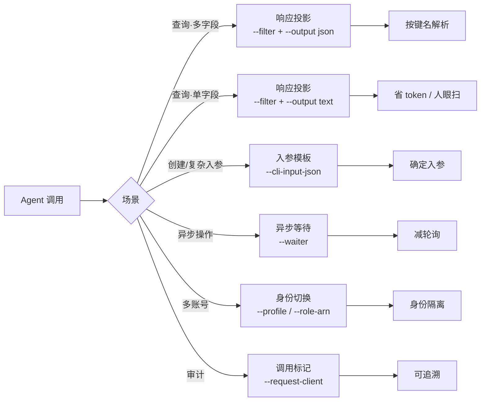

# Agent 优化模式

> 用 TCCLI 的正交 flag 组合降低响应体积与编排轮次：响应投影与输出格式、入参模板、异步等待原语、身份切换与云审计标记。本页只描述 **CLI 调用范式**，不替代各产品 How-to 的业务主路径，也不替代 skill 中的写操作确认纪律。
>
> 官方文档：[TCCLI 使用](https://cloud.tencent.com/document/product/440/6177)  
> 通用调用纪律：skill `tencentcloud-tccli-skill`

## 概述

TCCLI 提供一组彼此独立的 flag。Agent 可按场景叠加：在 CLI 侧完成字段裁剪与格式转换，以降低进入上下文的体积；用 `--waiter` 等长任务原语替代手写轮询，以减少工具往返。



### 适用判定

- 本会话已通过 `tccli <service> help` / `help --detail` 或最小只读调用确认过目标 Action 与响应键名后，再写 `--filter`。
- 尚未确认字段时：先 short help 顶层 OUTPUT，再按需 `help --detail` 或 `--Limit 1 --output json`（只读），勿臆造投影字段。
- 具体业务步骤、配额、状态机以产品 How-to 为准；本页只给 flag 组合。

### 调用成功怎么判

与 skill 一致。先看 **退出码**，再分流 stdout / stderr：

| 退出码 | 含义 | 看哪里 |
|:---|:---|:---|
| `0` | CLI 认为调用完成 | **stdout** 业务字段（默认无外层 `Response` 包装） |
| `252` | 参数或子命令解析失败 | **stderr**（`tccli: error: ...`） |
| `255` | API / SDK / 网络 / waiter 超时等 | **stderr**，常见一行：`[TencentCloudSDKException] code:... message:... requestId:...` |

要点：

- API 失败时 **stdout 常为空**；`code` / `message` / `requestId` 在 **stderr** 字符串中，不要假设 stdout 顶层存在 `{"Error":{"Code":...}}`。
- exit `0` 且 `TotalCount: 0` / 空数组：是**合法零命中**，不是失败。
- 需要稳定英文 `message` 时加 `--language en-US`（通道仍是 stderr）。

---

## 五个模式

### 1. 响应投影与输出格式 — 控制信息密度 {#1-响应投影与输出格式}

**何时用**：只读查询；需要裁剪字段以降低 token 与噪声。

| 场景 | 推荐组合 | 说明 |
|:---|:---|:---|
| 多字段，且需按名字解析 | `--filter` + `--output json` | Agent 默认优先；对象键序与投影书写一致 |
| 单字段，或人眼扫列表 | `--filter` + `--output text` | tab 分隔；无 JSON 结构开销 |
| 不建议默认 | `--output table` | 装饰字符多，不适合 Agent 解析 |

```bash
# 多字段：按键名解析（推荐 Agent）
# expected: exit 0；stdout 为 JSON 数组/对象，键序与投影书写一致
tccli cvm DescribeInstances --region ap-guangzhou \
  --filter "InstanceSet[?InstanceState=='RUNNING'].{id:InstanceId,name:InstanceName,zone:Placement.Zone}" \
  --output json
```

```bash
# 单字段：最低结构开销
# expected: exit 0；stdout 每行一个 InstanceId（无 JSON 花括号）
tccli cvm DescribeInstances --region ap-guangzhou \
  --filter "InstanceSet[?InstanceState=='RUNNING'].InstanceId" \
  --output text
```

`--filter` 使用 JMESPath，在 CLI 侧完成投影与条件过滤，支持管道与排序：

```bash
# 过滤 → 排序 → 取最新 3 条 InstanceId
# expected: exit 0；至多 3 行 InstanceId（按 CreatedTime）
--filter "InstanceSet[?InstanceState=='RUNNING'] | sort_by(@, &CreatedTime) | [-3:].[InstanceId]"
```

> ⚠️ **字段名必须等于真实响应键名**。错误字段名常 **exit 0 + 空输出**（静默），不会在 stderr 报「字段不存在」。首次使用某接口时，用 help 的 OUTPUT 或最小只读 JSON 核对键名后再写 `--filter`。

> ⚠️ **多键投影 + `--output text` 的列序**：投影 `{a:X, b:Y}` 在 `--output json` 下按书写 key 序输出；在 `--output text` 下**列序按投影 key 名字母序**，与书写顺序无关。例：`{id:ClusterId,name:ClusterName,ver:ClusterVersion,type:ClusterType}` 与 `{ver,type,id,name}` 的 text 列序相同，均为 `id,name,type,ver`。需要按固定列号解析时，用 `--output json`，或投影只取单字段。

```bash
# json：键序 = 书写序，适合按名字解析
# expected: exit 0；JSON 数组，对象键为 name 后 id（与书写一致）
tccli tcr DescribeInstances --region ap-guangzhou \
  --filter "Registries[].{name:RegistryName,id:RegistryId}" --output json

# text：列序 = key 字母序（id 在 name 前），与书写序无关
# expected: exit 0；每行 tab 分隔，先 RegistryId 对应值，后 RegistryName 对应值
tccli tcr DescribeInstances --region ap-guangzhou \
  --filter "Registries[].{name:RegistryName,id:RegistryId}" --output text
```

### 2. 入参模板 — 确定复杂入参 {#2-入参模板}

**何时用**：创建 / 修改资源，参数复杂或需反复执行。

#### 1. 生成入参骨架

```bash
# expected: exit 0；stdout/文件为 JSON 骨架，顶层含该 Action 的入参键
tccli cvm RunInstances --generate-cli-skeleton > template.json
```

#### 2. 编辑 `template.json`，填入实际值

#### 3. 按模板调用

```bash
# expected: 成功时 exit 0，stdout 含 InstanceIdSet 等业务字段；
# 失败时 exit 255（常见），stderr 含 code: / message: / requestId:
tccli cvm RunInstances --cli-input-json file://template.json
```

> ⚠️ **输出骨架未实现**：`--generate-cli-skeleton output` 不可用（仅 `input`）。学习出参结构：用 `help` / `help --detail` 的 OUTPUT，或对安全只读接口做最小查询（如 `--Limit 1 --output json`）。

### 3. 异步等待 — 长任务原语 {#3-异步等待}

**何时用**：创建、启动、扩容等异步操作，替代手写轮询循环。

```bash
# expected: waiter 在 timeout 内观测到目标状态后 exit 0 返回；
# 超时常见 exit 255，说明在 stderr
tccli cvm RunInstances --cli-input-json file://create.json \
  --waiter '{"expr":"InstanceStatusSet[0].InstanceState","to":"RUNNING","timeout":300,"interval":10}'
```

| waiter 参数 | 说明 | 默认值 |
|:-----------|:-----|:------|
| `expr` | JMESPath，指向轮询的状态字段 | 必填 |
| `to` | 目标值，匹配后返回 | 必填 |
| `timeout` | 超时秒数 | 180 |
| `interval` | 轮询间隔秒数 | 5 |

> ⚠️ **推荐可移植 JSON 对象字面量（双引号）**：`'{"expr":"...","to":"RUNNING"}'`。部分版本对 Python 风格单引号 dict 也能解析，但可移植性差，不要依赖。

### 4. 身份切换 — 多账号与跨账号角色 {#4-身份切换}

**何时用**：多账号、多地域、跨账号 STS 角色。

```bash
# 按 profile 切换
# expected: 使用 prod profile 凭证；未配置或无效时 exit 255，stderr 含 AuthFailure 类 code
tccli cvm DescribeInstances --profile prod

# 跨账号角色切换（RoleArn 形态以账号侧 CAM 配置为准）
# expected: 假定角色成功后 exit 0 并返回目标侧业务字段；RoleArn 无效则 exit 255，stderr 含 AuthFailure 类 code
tccli cvm DescribeInstances --profile master \
  --role-arn qcs::cam::uin/100000000001:roleName/cross-account-readonly \
  --role-session-name agent-session
```

### 5. 调用标记 — 云审计可追溯 {#5-调用标记}

**何时用**：多 Agent 协作，需在云审计中区分调用来源。

```bash
# expected: 业务调用 exit 0 时 stdout 为实例列表等业务字段；
# 云审计日志中 RequestClient / User-Agent 侧可含 deploy-agent/v2.1
tccli cvm DescribeInstances --region ap-guangzhou --request-client "deploy-agent/v2.1"
```

---

## 组合示例

上述 flag 正交可叠加。典型长任务链路（身份 → 模板入参 → 创建 → 等待就绪 → 投影结果 → 审计标记）：

```bash
# expected: 成功时 exit 0，stdout 为单个 InstanceId（text 单字段）；
# 失败时 exit 非 0，读 stderr 中的 code: / message:（勿只在 stdout 找 Error 键）
tccli cvm RunInstances \
  --profile prod \
  --request-client "deploy-agent/v1.0" \
  --cli-input-json file://create.json \
  --waiter '{"expr":"InstanceStatusSet[0].InstanceState","to":"RUNNING","timeout":300,"interval":10}' \
  --filter "InstanceIdSet[0]" \
  --output text
```

flag 书写顺序不影响语义。多字段结果投影时，将末两行改为 `--filter "…多键…"` 与 `--output json`。

---

## 限制与权衡

| 属性 | 值 | 说明 |
|:-----|:---|:-----|
| `--filter` 字段名 | 须匹配响应键名 | 写错常 **exit 0 + 空输出**（静默） |
| 空列表 / `TotalCount: 0` | 成功查询的零命中 | 不是失败；如实报告「未找到」 |
| API 失败信息通道 | 多为 **stderr** | 非 stdout 顶层 `Error` JSON |
| 输出骨架 | 未实现 | 用 help OUTPUT 或最小只读查询学习出参 |
| API 限频 | 默认约 10 次/秒 | 批量串行或加间隔，避免 `RequestLimitExceeded` |
| `--cli-unfold-argument` | Agent 不用 | 面向交互式终端；Agent 用 JSON 或 `file://` |
| `--output table` | 不默认 | 装饰多，解析差 |
| 本页边界 | 仅 CLI 范式 | 业务步骤见 How-to；写操作确认见 skill |

---

## 下一步

- [TKE 快速入门](../quickstart/tke-first-cluster.md) — 实战中使用投影、模板与等待
- [TCR 快速入门](../quickstart/tcr-first-registry.md) — 镜像推送链路中的模板与等待
- [查询和过滤集群](../tke/clusters/query.md) — `--filter` JMESPath 产品实战
- [创建集群](../tke/clusters/create.md) — `--cli-input-json` 模板驱动实战
