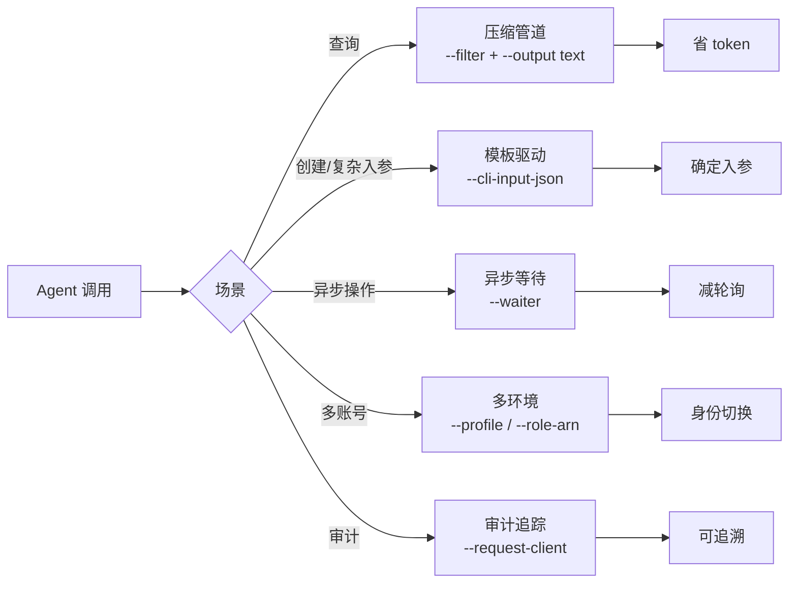

# Agent 优化模式

> 如何用 TCCLI 的 Agent 优化 flag 组合来省 token、等异步、模板化调用、标记身份。这些模式让 agent 高效驱动 TCCLI 完成长任务。

## 概述

TCCLI 提供 5 个正交 flag，agent 可按场景组合。本质是把数据变换从推理层下沉到执行层——用 CLI 本地算力换 agent 的 token 预算，用长任务原语换轮询轮次。



## 5 个模式

### 1. 压缩管道 — 省 token

**何时用**：查询资源列表，无需完整 JSON。每次查询默认启用。

```bash
# token 开销最低的查询模式
tccli cvm DescribeInstances --region ap-guangzhou \
  --filter "InstanceSet[?InstanceState=='RUNNING'].{id:InstanceId,name:InstanceName,zone:Placement.Zone}" \
  --output text
```

`--filter`（JMESPath）裁剪字段，`--output text` 去 JSON 结构开销。支持条件过滤、多级管道、排序：

```bash
# 过滤 → 排序 → 取最新 3 条
--filter "InstanceSet[?State=='RUNNING'] | sort_by(@, &CreatedTime) | [-3:].[InstanceId]"
```

> ⚠️ `--filter` 字段名必须匹配 API 实际响应键名。首次用某接口时，先 `--Limit 1` 看响应结构，再构造 `--filter`。

### 2. 模板驱动 — 确定入参

**何时用**：创建/修改资源，参数复杂或反复执行。

```bash
# 1. 生成入参模板
tccli cvm RunInstances --generate-cli-skeleton > template.json

# 2. 编辑 template.json，填入实际值

# 3. 模板调用
tccli cvm RunInstances --cli-input-json file://template.json
```

> ⚠️ 输出骨架（`--generate-cli-skeleton output`）未实现。获取输出结构的方法：先用最小查询（如 `--Limit 1`）调一次，从响应学习返回结构，再写 `--filter`。

### 3. 异步等待 — 长任务原语

**何时用**：创建、启动、扩容等异步操作，替代手写轮询循环。

```bash
tccli cvm RunInstances --cli-input-json file://create.json \
  --waiter '{"expr":"InstanceStatusSet[0].InstanceState","to":"RUNNING","timeout":300,"interval":10}'
```

| waiter 参数 | 说明 | 默认值 |
|:-----------|:-----|:------|
| `expr` | JMESPath，指向轮询的状态字段 | 必填 |
| `to` | 目标值，匹配后返回 | 必填 |
| `timeout` | 超时秒数 | 180 |
| `interval` | 轮询间隔秒数 | 5 |

> ⚠️ waiter 参数必须用 **JSON 格式**（双引号），不能用 Python dict（单引号）。正确：`'{"expr":"...","to":"RUNNING"}'`。

### 4. 多环境切换 — 身份隔离

**何时用**：管理多账号、多地域、跨账号 STS 角色。

```bash
# 按 profile 切换
tccli cvm DescribeInstances --profile prod

# 跨账号 STS 角色切换
tccli cvm DescribeInstances --profile master \
  --role-arn arn:aws:sts::123456789:role/cross-account-readonly \
  --role-session-name agent-session
```

### 5. 审计追踪 — 标记 agent 身份

**何时用**：多 agent 协作，区分调用来源（进 CloudAudit 日志）。

```bash
tccli cvm DescribeInstances --region ap-guangzhou --request-client "deploy-agent/v2.1"
```

## 组合示例

5 个 flag 正交可叠加，典型 agent 长任务链路：

```bash
# 选身份 → 模板入参 → 创建 → 等待就绪 → 取最小结果 → 标记审计
tccli cvm RunInstances \
  --profile prod \
  --request-client "deploy-agent/v1.0" \
  --cli-input-json file://create.json \
  --waiter '{"expr":"InstanceStatusSet[0].InstanceState","to":"RUNNING","timeout":300,"interval":10}' \
  --filter "InstanceIdSet[0]" \
  --output text
```

**叠加顺序**：`--profile` → `--cli-input-json` → `--waiter` → `--filter` → `--output text`。顺序不影响结果。

## 限制与权衡

| 属性 | 值 | 原因 |
|:-----|:---|:-----|
| `--filter` 字段名 | 须匹配响应键名 | JMESPath 严格匹配，写错返回空 |
| 输出骨架 | 未实现 | 用最小查询替代学习输出结构 |
| API 限频 | 默认 10/s | 批量操作需串行或加间隔，避免 `RequestLimitExceeded` |
| `--cli-unfold-argument` | agent 不用 | 人工点连接展开设计，agent 直接用 JSON |

## 下一步

- [TKE 快速入门](../quickstart/tke-first-cluster.md) — 实战中用这些模式创建集群
- [TCR 快速入门](../quickstart/tcr-first-registry.md) — 推送镜像用模板与等待
- [查询和过滤集群](../tke/clusters/query.md) — `--filter` JMESPath 实战
- [创建集群](../tke/clusters/create.md) — `--cli-input-json` 模板驱动实战
