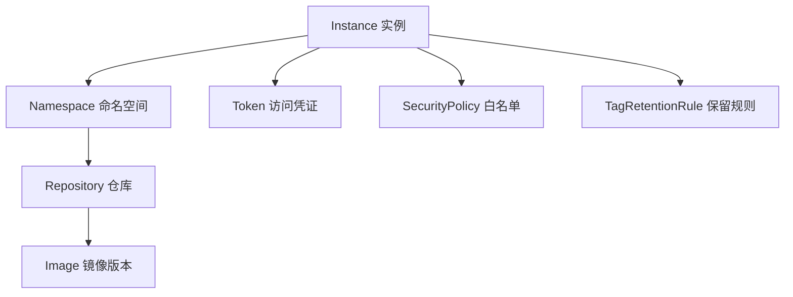

# TCR 容器镜像服务

> 腾讯云容器镜像服务 (Tencent Container Registry) — 安全、高性能的 Docker/OCI 镜像仓库。

## 是什么

TCR 是腾讯云的容器镜像托管服务。它提供企业级镜像仓库: 私有存储、访问控制、镜像安全扫描、生命周期自动清理、跨地域同步。

核心对象关系:



## 适合谁

| 角色 | 目标 | 主要文档 |
|------|------|-------------|
| 开发者 | 推送/拉取镜像 | [Quickstart](../quickstart/tcr-first-registry.md) |
| DevOps | CI/CD 流水线集成 | [访问控制](access/manage.md) |
| SRE | 镜像安全、生命周期管理 | [生命周期](lifecycle/index.md) |
| 运维 | 多地域同步、高可用 | 实例同步 (API) |

## 核心概念

| 概念 | 含义 | 为什么重要 |
|------|------|-----------|
| Instance | TCR 企业版实例 | 镜像的顶级容器，每个实例有独立域名和存储 |
| Namespace | 仓库的逻辑分组 | 组织镜像（如 `backend` / `frontend`），对应 K8s namespace |
| Repository | 单个镜像的存储单元 | 如 `backend/api-server`，包含多个 Tag |
| Image Tag | 镜像版本标识 | `v1.0.0` / `latest`，Tag 可被覆盖（除非开启不可变） |
| Token | 长期访问凭证 | docker login 的密码，比临时凭证更适合 CI/CD |

## 企业版 vs 个人版

| 维度 | 企业版 | 个人版 |
|------|--------|--------|
| 隔离 | 独享实例 | 共享 |
| 存储 | 100GB ~ 1TB+ | 免费额度 |
| 功能 | 全部（同步、GC、签名、不可变 Tag） | 基本（仓库+Tag 管理） |
| 费用 | 按量/包年包月计费 | 免费 |

## 不适用场景

- 只有几个公开镜像 → [Docker Hub](https://hub.docker.com/) 免费
- 只在本地开发 → 自建 `docker run registry:2`
- 需要 OCI 兼容但不限于镜像 → 考虑 Harbor 自建

## 快速检查

```bash
tccli tcr DescribeInstances --region ap-guangzhou
# expected: { "Response": { "TotalCount": ..., "Registries": [...] } }
```

## 导航

- [创建实例](instances/create.md) — 创建你的第一个 TCR 实例
- [管理访问](instances/manage-access.md) — 开启公网/内网、创建 Token
- [管理仓库](repositories/manage.md) — 命名空间和仓库 CRUD
- [推送镜像](images/push-pull.md) — docker push 你的第一个镜像
- [访问控制](access/manage.md) — Token、白名单、VPC 链接
- [生命周期](lifecycle/index.md) — 自动清理旧版本
