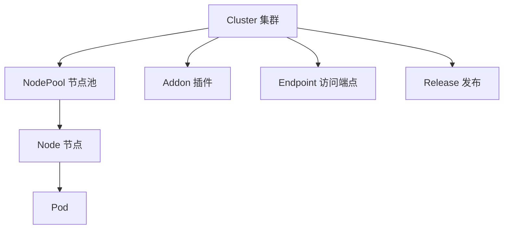

# TKE 容器服务

> 腾讯云容器服务 (Tencent Kubernetes Engine) — 在云上运行和管理 K8s 集群。

## 是什么

TKE 是腾讯云的托管 Kubernetes 服务。你创建一个 K8s 集群，腾讯云管理 Master 节点（托管模式），你只需要管理工作节点。支持标准的 K8s API、kubectl 和 Helm。

核心对象关系:



## 适合谁

| 角色 | 目标 | 主要文档 |
|------|------|-------------|
| 开发者 | 部署应用到 K8s，不需要管 Master | [Quickstart](../quickstart/tke-first-cluster.md) |
| 运维/SRE | 管理集群生命周期、节点、监控 | [集群管理](clusters/index.md) |
| 安全工程师 | 审计、加密、认证、权限控制 | [安全](security/index.md) |
| 架构师 | 多集群、混合云、边缘计算 | [专用工作负载](specialized/index.md) |

## 触发条件

- 你要在腾讯云上运行/管理 Kubernetes 集群（创建、查询、升级、删除）— 本域是入口
- 你已读完 [快速入门](../quickstart/tke-first-cluster.md)，想深入某个具体操作（节点池/网络/安全/可观测）— 看下方下一步或 [集群管理](clusters/index.md)
- 你遇到 TKE API 双版本困惑（`2018-05-25` vs `2022-05-01` 哪个该用）— 直接看 [API 版本选择](#api-版本选择)

## 核心概念

| 概念 | 含义 | 为什么重要 |
|------|------|-----------|
| Cluster | K8s 集群（托管或独立） | 所有资源的顶级容器，决定了网络和版本 |
| NodePool | 一组相同规格的节点 | 弹性伸缩的基本单位，不同池可设不同策略 |
| Node | 运行 Pod 的 CVM 实例 | 节点是实际的算力，4 种类型: Regular/Native/Super/External |
| Addon | 集群插件（网络、存储、监控） | 扩展集群功能，如 CBS CSI、Nginx Ingress |
| Endpoint | 集群 API Server 的访问入口 | 公网/内网访问 kubectl 的方式 |
| Release | 集群内应用发布（类 Helm） | 管理应用的生命周期 |
| API 版本 | 2018-05-25（旧，全功能 271 Action）vs 2022-05-01（新，官方当前版本 22 Action） | 决定用哪版 API；同名 Action 契约可能不同，命令须显式带 `--version` |

## Cluster 类型

| 类型 | 最佳场景 | Master | 升级 | 价格 |
|------|---------|:---:|:---:|------|
| MANAGED_CLUSTER (托管) | 生产环境首选 | 腾讯云运维 | 控制台/API 一键 | 集群管理费 + 节点费 |
| INDEPENDENT_CLUSTER (独立) | 完全控制 | 你运维 3 台 CVM | 手动 | 节点费（含 Master CVM） |

## Node 类型

| 类型 | 含义 | 适用场景 |
|------|------|---------|
| Regular (普通节点) | 标准 CVM 实例 | 常规工作负载 |
| Native (原生节点) | 腾讯云优化的 CVM | 更高性能、更低开销 |
| Super (超级节点) | Serverless 虚拟节点 | 弹性补充、批处理 |
| External (第三方节点) | 非腾讯云机器 | 混合云 |

## 不适用场景

- 只有一两个容器 → [CVM](https://cloud.tencent.com/product/cvm) + Docker Compose
- Serverless、不想管集群 → [EKS 弹性集群](specialized/eks-cluster.md) 或 [Cloud Run](https://cloud.tencent.com/product/tcbr)
- 边缘计算（IDC/门店）→ [边缘集群 TKEEdge](specialized/edge-cluster.md)
- 需要多云 K8s → 考虑 KubeVela 或 Crossplane

## API 版本选择

TKE 有两个 API 版本，tccli 默认走 `2018-05-25`，但**官方当前版本是 `2022-05-01`**（tccli 的 `(recommended)` 标记只是对版本列表首元素的机械标记，不代表官方推荐）。

**速查**:

| 操作领域 | 用哪个版本 | 理由 |
|:---------|:---------|:-----|
| 节点池 CRUD / 机器启停 / 健康检查 / GPU 查询 | **2022-05-01** | 旧版无此 Action，或新版 Native 强类型抽象更优 |
| 集群创建/删除/升级、网络、Prometheus、边缘、EKS、Release | **2018-05-25** | 新版无此 Action，只能用旧版 |
| `DescribeClusters`（两版同名） | **2022-05-01**（默认） | 入参两版一致，无倾向时选官方当前版 |

**三条铁律**:
1. **同名≠同契约**: `DescribeClusterInstances` 入参两版不兼容（旧 `InstanceIds`/`InstanceRole` vs 新 `SortBy`/`NeedTags`），切换前用 `--generate-cli-skeleton` 核契约
2. **显式 `--version`**: 任何 TKE 命令都带 `--version`，避免同名 Action 静默走旧版
3. **解析响应容错缺失**: 新版响应多 `Errors` 字段，旧版无，按字段名取值

> 本指南内 [创建节点池](nodes/nodepool-create.md) 与 [节点运维](nodes/instance-ops.md) 已按版本标注命令。

## 快速检查

```bash
tccli tke DescribeClusters --region ap-guangzhou --Limit 1
# expected: { "TotalCount": ..., "Clusters": [...] }（tccli 默认剥离 Response 包装层）
```

## 下一步

- [创建集群](clusters/create.md) — 创建你的第一个 TKE 集群
- [节点池](nodes/index.md) — 给集群添加工作节点
- [网络](networking/index.md) — 配置集群访问端点
- [应用发布](releases/index.md) — 用 Helm Release 部署应用
