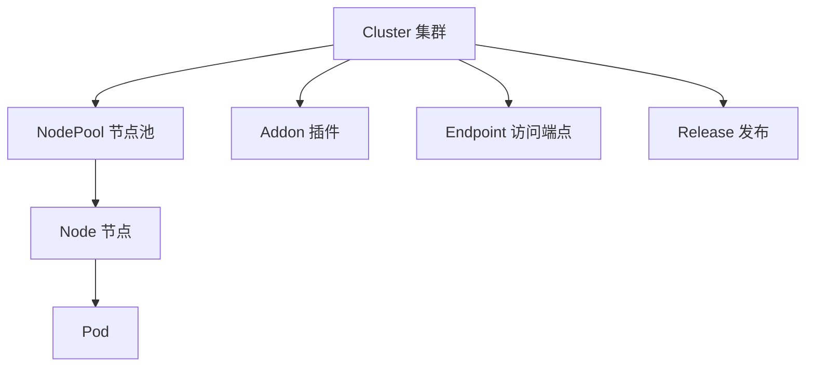

# TKE 容器服务

> 腾讯云容器服务 (Tencent Kubernetes Engine) — 在云上运行和管理 K8s 集群。

## 是什么

TKE 是腾讯云的 Kubernetes 服务：在云资源集合（CVM、负载均衡等）上运行容器应用。**标准集群**由腾讯云托管 Master/Etcd，你购置并管理工作节点；同一标准集群内可混用普通节点、原生节点、超级节点与注册节点。另有 Serverless（EKS）、边缘等形态——部分已关闭新建入口，见 [不适用场景](#不适用场景)。

核心对象关系:



## 适合谁

| 角色 | 目标 | 主要文档 |
|------|------|-------------|
| 开发者 | 部署应用到 K8s，不需要管 Master | [Quickstart](../quickstart/tke-first-cluster.md) |
| 运维/SRE | 管理集群生命周期、节点、监控 | [集群管理](clusters/index.md) |
| 安全工程师 | 审计、加密、认证、权限控制 | [安全](security/index.md) |
| 架构师 | Serverless、边缘计算、混合云接入 | [专用工作负载](specialized/index.md) + [扩展节点](nodes/external-nodes.md) |

## 触发条件

- 你要在腾讯云上运行/管理 Kubernetes 集群（创建、查询、升级、删除）— 本域是入口
- 你已读完 [快速入门](../quickstart/tke-first-cluster.md)，需查阅某个具体操作（节点池/网络/安全/可观测）— 看下方下一步或 [集群管理](clusters/index.md)
- 你遇到 TKE API 双版本困惑（`2018-05-25` vs `2022-05-01` 哪个该用）— 直接看 [API 版本选择](#api-版本选择)

## 核心概念

| 概念 | 含义 | 为什么重要 |
|------|------|-----------|
| Cluster（集群） | 容器运行所需云资源的集合（含 CVM、CLB 等）；标准集群 = Master/Etcd 托管 + 你管工作节点 | 所有资源的顶级容器；决定地域、网络插件、K8s 版本（地域/CNI/CIDR/IPVS 等创建后难改） |
| Node（节点） | 组成集群的基本元素（虚拟机或物理机）；含 Kubelet、Kube-proxy 等 | 实际算力；4 种：普通(`Regular`)/原生(`Native`)/超级(`Super`)/注册(`External`) |
| NodePool（节点池） | 统一机型、标签、Taint 与动态扩缩容的节点组 | 弹性伸缩与批量运维的基本单位 |
| Addon（扩展组件） | 事件持久化、日志、GPU、CBS/COS/CFS 等可安装组件 | 扩展集群能力；创建流「组件配置」步多为创建后 `InstallAddon` |
| Endpoint | 集群 API Server 的访问入口 | 公网/内网 kubectl 连通方式 |
| Release | 集群内应用发布（类 Helm） | 管理应用生命周期 |
| API 版本 | `2018-05-25`（全功能，含 CreateCluster/网络/Prometheus/EKS/边缘）vs `2022-05-01`（节点池等子集） | **建集群只能用 2018-05-25**；同名 Action 契约可能不同，须显式 `--version` |

## Cluster 类型

| 类型 | 最佳场景 | Master | 升级 | 价格 | 新建 |
|------|---------|:---:|:---:|------|:----:|
| MANAGED_CLUSTER (托管) | 生产环境 | 腾讯云运维 | 控制台/API 一键 | 集群管理费 + 节点费 | ✅ |
| INDEPENDENT_CLUSTER (独立) | 存量：完全控制 Master | 你运维 Master CVM | 手动 | 节点费（含 Master CVM） | ❌ 已停止新建 |

## 控制台创建流全景

> 控制台「新建集群」是进入 TKE 的第一个决策流。下表把控制台决策步映射到 tccli Action/字段与承载文档，标明每步调用哪个 Action、哪篇文档展开。控制台按决策步组织，tccli 按 Action 组织——本表是两者间的地图。
>
> **先选集群形态**（控制台第一屏）：TKE 标准集群（`CreateCluster`，默认）/ Serverless·EKS 集群（[存量运维](specialized/eks-cluster.md)，**新建入口已关闭**；新建免 CVM 用标准集群 + [虚拟节点](nodes/virtual-nodes.md)，两步）/ 注册集群（与 [注册节点](nodes/external-nodes.md) 不同；控制台标即将下线）。控制台「容器实例」CPU/GPU 不在本向导内，见 [容器实例](specialized/eks-cluster.md#创建容器实例部署-pod)。

### 托管集群（4 步）

| 控制台步 | 决策项 | tccli 字段 / Action | 承载文档 |
|:--------|:------|:-------------------|:--------|
| **① 集群信息** | 集群名称/Master&Etcd维护/集群规格/自动升配/ETCD资源拆分/地域/K8s版本/运行时/镜像OS/标签/安全增强/hostname/自定义参数/CDC/项目/描述/删除保护/高可用/数据加密 | `CreateCluster` 入参（`ClusterBasicSettings`/`ClusterCIDRSettings`/`ClusterAdvancedSettings`/`CdcId`）；**数据加密除外**=`EnableEncryptionProtection`（独立 Action，创建后开） | [创建集群](clusters/create.md) 关键字段表；数据加密 → [集群防护 — etcd 加密](security/protection.md) |
| **② 网络配置** | 集群IP类型/VPC/容器网络插件/网络模式(共享/独立网卡)/固定PodIP/容器子网/Service IP段 + 高级(Dataplane v2/Kube-proxy模式/IP回收/ClusterIP增强)。**插件推荐序（按场景选，非 api 默认）**：①需固定 Pod IP/安全组直通 → VPC-CNI；②要省 VPC IP、可后期扩网段 → GR；③要 Cilium 数据面且不占 VPC IP → CiliumOverlay | `CreateCluster` 入参（`NetworkType`/`IsDualStack`/`VpcCniType`/`ClusterCIDRSettings`/`DataPlaneV2`/`KubeProxyMode`/`IPVS`） | [创建集群 — 跨字段约束](clusters/create.md#跨字段约束) + [网络管理](networking/index.md) |
| **③ 组件配置** | **默认会装**：CBS + monitoragent + ip-masq-agent。另可选：存储(COS/CFSTurbo/CFS)、增强组件（控制台 **30+**，按监控/镜像/DNS/调度/网络/GPU/安全等分类）、云原生服务（Prometheus 等，创建时可勾选） | `InstallAddon`/`UpdateAddon`（独立 Action 族，**创建后装**；Prometheus 另属可观测 Action 族） | [插件管理](addons/index.md) + [可观测](observability/index.md) |
| **④ 信息确认** | 参数复核 | —（无 tccli 对应，控制台确认步） | — |

### 独立集群（5 步，多 Master 配置步）

独立集群比托管多一步 **Master 配置**（创建 Master&Etcd 的 CVM），其余步同托管。

| 控制台步 | 决策项 | tccli 字段 / Action | 承载文档 |
|:--------|:------|:-------------------|:--------|
| **③ Master 配置**（仅独立） | 节点来源(新增/已有)/计费模式/Master&Etcd节点配置(可用区/网络/机型/系统盘/数据盘/公网带宽/实例名/数量≤7/登录方式/SSH密钥) + 高级(CAM角色/容器目录/安全加固/云监控/cordon/Labels/Taints/自定义脚本) | `CreateCluster` 的 `RunInstancesForNode`（**`NodeRole=MASTER_ETCD`**，透传 CVM RunInstances 全参数） | [创建集群](clusters/create.md) 路径 B + [独立集群 Master 运维](clusters/master-ops.md) |

> ⚠️ **控制台步 ≠ 单个 Action**：步①的"数据加密"和步③"组件配置"是**独立 Action**（`EnableEncryptionProtection`/`InstallAddon`），创建集群后单独调用——控制台把多 Action 收进一个 UI 流，tccli 须分步执行。步①可选入参（ETCD拆分/自定义参数/CDC/高可用/自动升配/安全增强/集群描述等，`required=False`）不传也调通，agent 不传则静默漏建，须按需补。
>
> **创建后改不了（须在创建时定）**：地域、网络插件（`NetworkType`；仅 VPC-CNI 可事后开启）、Service CIDR 等——变更须重建集群或走受限变更路径，见各专题。
>
> **分支穷尽**：控制台创建流须同时索取托管(4步)/独立(5步)两个分支，独立多 Master 配置步用 `RunInstancesForNode NodeRole=MASTER_ETCD`。存量 Serverless·EKS / 注册集群是**单页向导**，勿套用本表四步；见 [EKS](specialized/eks-cluster.md) / [扩展节点](nodes/external-nodes.md)。**超级/虚拟节点**不在「新建集群」向导内：先完成本表 `CreateCluster`，再走 [虚拟节点](nodes/virtual-nodes.md)。

## Node 类型

> Worker 节点是容器集群的基本元素，包含运行 Pod 所需的 Kubelet、Kube-proxy 等组件。TKE 标准集群支持以下 4 种节点类型：

| 类型 | API 枚举值 | 特点 | 适用场景 |
|------|:---------:|------|---------|
| 普通节点 | `Regular` | 适配腾讯云 CVM 数十种机型；基于弹性伸缩服务自动缩容；用户对资源和运维管控强，OS 偏定制化 | 常规工作负载 |
| 原生节点 | `Native` | 搭载 TKE Insight 可视化资源大盘；专有调度器助力节点均衡负载、提升装箱；基础设施声明式 API，像管理 workload 一样管理节点 | 降本提效、简化运维 |
| 超级节点 | `Super` | Serverless 理念，运维轻量化；单 Pod 独占轻量虚拟机，强隔离无干扰；秒级扩缩容 | 弹性业务、隔离性要求高、轻量运维 |
| 注册节点 | `External` | IDC 资源接入云端管理，本地资源利旧；云下云上混合调度；支持日志/监控/事件/安全等云原生能力 | 云上云下资源统一管理（边缘场景优先 [注册节点公网版](https://cloud.tencent.com/document/product/457/57916)；勿与「注册集群」混淆） |

## 不适用场景

- 只有一两个容器、不需要 K8s 编排 → [CVM](https://cloud.tencent.com/product/cvm) + Docker Compose
- **新建**免 CVM、要 K8s 编排 → **不要** `CreateEKSCluster`：① [标准集群](clusters/create.md)（`CreateCluster`）② [虚拟节点](nodes/virtual-nodes.md)；仅调 `CreateCluster` 不等于免 CVM 算力。无集群只要容器 → [容器实例](specialized/eks-cluster.md#创建容器实例部署-pod)。存量 EKS 见 [EKS](specialized/eks-cluster.md)（新建入口已关闭）
- **新建**边缘/IDC 集群 → **不要**再开 TKE-Edge：用 [注册节点公网版](https://cloud.tencent.com/document/product/457/57916)；存量见 [边缘集群](specialized/edge-cluster.md)（已于 2024-08-28 下线）
- 把「注册集群」与「注册节点」混用 → 注册节点走 [扩展节点](nodes/external-nodes.md)；注册集群控制台标即将下线，勿套用到注册节点配额
- 需要多云 K8s 控制面 → 考虑 KubeVela / Crossplane（非本产品范围）

## API 版本选择

TKE 有两个 API 版本，TCCLI 默认走 `2018-05-25`，但**官方当前版本是 `2022-05-01`**（TCCLI 的 `(recommended)` 标记只是对版本列表首元素的机械标记，不代表官方推荐）。

**速查**:

| 操作领域 | 用哪个版本 | 理由 |
|:---------|:---------|:-----|
| 节点池 CRUD / 机器启停 / 健康检查 / GPU 查询 | **2022-05-01** | 旧版无此 Action，或新版 Native 强类型抽象更优 |
| 集群创建/删除/升级、网络、Prometheus、边缘、EKS、Release | **2018-05-25** | 新版无此 Action，只能用旧版 |
| `DescribeClusters`（两版同名） | **2022-05-01**（默认） | 入参两版一致，无倾向时选官方当前版 |

**三条铁律**:
1. **同名≠同契约**: `DescribeClusterInstances` 入参两版不兼容（旧 `InstanceIds`/`InstanceRole` vs 新 `SortBy`/`NeedTags`），切换前用 `--generate-cli-skeleton` 核契约
2. **显式 `--version`（仅同名 Action 必需）**: TKE 的两个 API 版本各自有**独占 Action**（如 `CreateCluster`/`DeleteCluster` 仅 2018-05-25、`CreateNodePool`/`ModifyNodePool` 仅 2022-05-01）——这类命令省略 `--version` 会走 TCCLI 默认版（2018-05-25），恰好就是它们唯一的版本，**省略不会错**。真正需要显式 `--version` 的是**两版同名**的 Action：`DescribeClusters`/`DescribeClusterInstances`/`DescribeClusterNodePools`(旧名) 等——省略会静默走默认版，可能与意图错位。**判据**：命令在该版本是唯一归属 → 可省；两版同名 → 必带 `--version`（或用 `--generate-cli-skeleton` 核归属）。
3. **解析响应容错缺失**: 新版响应多 `Errors` 字段，旧版无，按字段名取值

> 本指南内 [创建节点池](nodes/nodepool-create.md) 与 [节点运维](nodes/instance-ops.md) 已按版本标注命令。TCCLI 默认版为 `2018-05-25`（即 `tccli tke help` 首行），quickstart 的 `CreateCluster`/`DeleteCluster` 属该版独占 Action，故 quickstart 不写 `--version` 与本条不冲突。

## 快速检查

```bash
tccli tke DescribeClusters --region ap-guangzhou --Limit 1
# expected: { "TotalCount": ..., "Clusters": [...] }（tccli 默认剥离 Response 包装层）
```

## 下一步

- [创建集群](clusters/create.md) — 创建你的第一个 TKE 集群（控制台创建流全景见本文上方）
- [节点池](nodes/index.md) — 给集群添加工作节点
- [网络](networking/index.md) — 配置集群访问端点、容器网络模型
- [安全](security/index.md) — 认证配置、审计日志
- [可观测](observability/index.md) — Prometheus 监控、日志采集
- [插件](addons/index.md) — 安装/管理集群组件（存储/监控/网络/GPU 等）
- [应用发布](releases/index.md) — 用 Helm Release 部署应用
- [专用工作负载](specialized/index.md) — EKS Serverless、边缘集群
- [参考](reference/states.md) — 状态机、配额、错误码、共享字段
